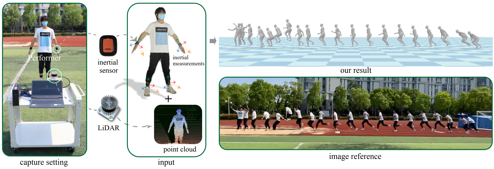
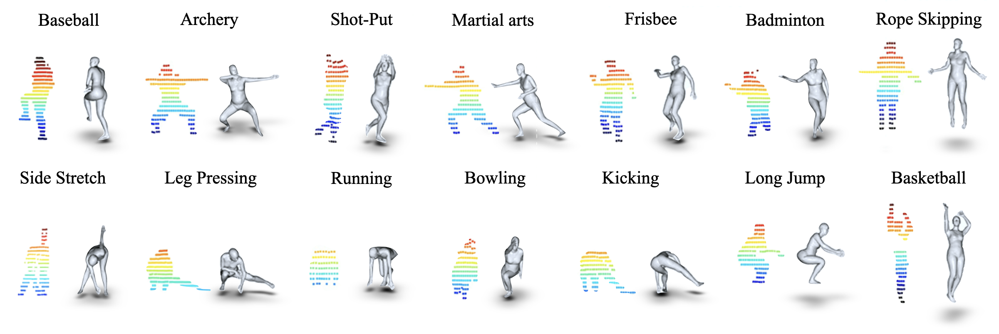

<p align="center">
  <h1 align="center">LiDAR-aid Inertial Poser: Large-scale Human Motion Capture by Sparse Inertial and LiDAR Sensors</h1>
  <h3 align="center"><a href="https://arxiv.org/pdf/2205.15410">Paper</a> | <a href="https://www.youtube.com/watch?v=ao9eTGPQT6k">Video</a> | <a href="https://drive.google.com/file/d/1SVO77FWFUOtC-Et2sdlgAdiNQWzgzxt0/view?usp=sharing">Dataset</a> | <a href="https://4dvlab.github.io/project_page/LIPD.html">Project Page</a></h3></p>

*The source code of our work "LiDAR-aid Inertial Poser: Large-scale Human Motion Capture by Sparse Inertial and LiDAR Sensors", accepted to TVCG 2023*

<p align="center">
  <a href="">
    
  </a>
</p>
<hr>

## Abstract
*We propose a multi-sensor fusion method for capturing challenging 3D human motions with accurate consecutive local poses and global trajectories in large-scale scenarios, only using single LiDAR and 4 IMUs, which are set up conveniently and worn lightly. Specifically, to fully utilize the global geometry information captured by LiDAR and local dynamic motions captured by IMUs, we design a two-stage pose estimator in a coarse-to-fine manner, where point clouds provide the coarse body shape and IMU measurements optimize the local actions. Furthermore, considering the translation deviation caused by the view-dependent partial point cloud, we propose a pose-guided translation corrector. It predicts the offset between captured points and the real root locations, which makes the consecutive movements and trajectories more precise and natural. Moreover, we collect a LiDAR-IMU multi-modal mocap dataset, LIPD, with diverse human actions in long-range scenarios. Extensive quantitative and qualitative experiments on LIPD and other open datasets all demonstrate the capability of our approach for compelling motion capture in large-scale scenarios, which outperforms other methods by an obvious margin. We will release our code and captured dataset to stimulate future research.*
<hr>

## Dataset
<p align="center">
  <a href="">
    
  </a>
</p>

You can download the LIPD and synthetic data used in paper(AMASS, ACCAD, AIST++, etc.). The .zip file contains point cloud data and the preprocessed data in pkl. The `path.pkl` has `imu data`, `ground truth data`, `sequence id` and `point cloud path`, you should update the path or modify the `LIPD/dataset/LIP_dataset.py` when load the point cloud data.

<hr>

## Usage
### Prepare SMPL body model
1. Download SMPL model from [here](https://smpl.is.tue.mpg.de/). You should click `SMPL for Python` and download the `version 1.0.0 for Python 2.7 (10 shape PCs)`.
2. We also prepare the SMPL from [here](https://drive.google.com/file/d/1n87YRtYIsb2zfT9_NGx8ZHVtJRuq02aI/view?usp=sharing), you can download and update the `smpl` directory.
   
### Training steps

#### Training for `Global temporal pose-prior distillation`
```Shell
python train_dis.py --save_path path_to_save_the_model --exp_name name_of_each_exp --root_dataset_path path_of_preprocessed_data --test_data --train_data
```
Save the results(human 3D joints and global rotation in 6D) and training for next module.
```Shell
python train_dis.py --train 0 --save_name path_to_save_result --root_dataset_path path_of_preprocessed_data --pretrained pretrained_model --test_data
```
#### Training for `Hierarchical pose estimation`
```Shell
python train_est.py --save_path path_to_save_the_model --exp_name name_of_each_exp --dis_result result_path_of_distillation --root_dataset_path path_of_preprocessed_data --test_data --train_data
```
Save the results(human SMPL parameters, refined human 3D joints) and training for the next module. 
```Shell
python train_est.py --train 0 --save_name path_to_save_result --dis_result result_path_of_distillation --root_dataset_path path_of_preprocessed_data --pretrained pretrained_model --test_data
```
#### Training for `Pose-guided Translation Correction`
```Shell
python train_ptc.py --save_path path_to_save_the_model --exp_name name_of_each_exp --est_result result_path_of_estimation --root_dataset_path path_of_preprocessed_data --test_data --train_data
```
#### Example

You should download the LIPD testing dataset like `./data/LIPD_test.pkl`, and we provide the pretrained models from [here](https://drive.google.com/file/d/13FLltvvMLOTiRFQdvB9PW2iWUQ95hjzi/view?usp=sharing) and update the `./save_models`.
```Shell
python train_dis.py --train 0 --save_name ./dis_results/LIPD --root_dataset_path ./data/ --pretrained ./save_models/ --test_data LIPD_test.pkl
python train_est.py --train 0 --save_name ./est_results/LIPD --root_dataset_path ./data/ --pretrained ./save_models/ --test_data eLIPD
python train_ptc.py --train 0 --root_dataset_path ./data/ --pretrained ./save_models/
```
You should download the LIPD training dataset `./data/LIPD_train.pkl` and follow the training dataset in paper to download additional synthetic data. Here is a simple training example that only covers the LIPD data:
```Shell
python train_dis.py --save_path ./save_models --exp_name LIPD --root_dataset_path ./data/ --train_data 
python train_est.py --save_path ./save_models --exp_name LIPD --dis_result ./dis_results --root_dataset_path ./data/ --train_data
```
The `Pose-guided Translation Correction` need synthetic CMU data to provide accurate ground-truth location, the LIPD data only used for evaluation.
```Shell
python train_ptc.py --save_path ./save_models --exp_name LIPD --root_dataset_path ./data/ --train_data
```
<hr>

## Citation
If you find the project helpful, please consider citing us:
```
@ARTICLE{10049734,
  author={Ren, Yiming and Zhao, Chengfeng and He, Yannan and Cong, Peishan and Liang, Han and Yu, Jingyi and Xu, Lan and Ma, Yuexin},
  journal={IEEE Transactions on Visualization and Computer Graphics}, 
  title={LiDAR-aid Inertial Poser: Large-scale Human Motion Capture by Sparse Inertial and LiDAR Sensors}, 
  year={2023},
  volume={29},
  number={5},
  pages={2337-2347},
  doi={10.1109/TVCG.2023.3247088}}
```